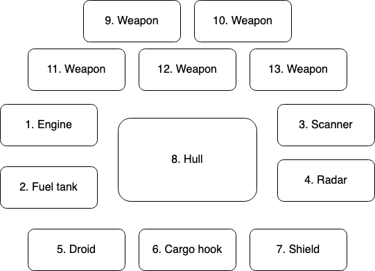

## Space MMO Project
### Total time spent on the project
[](https://wakatime.com/badge/user/df48eb2c-43c1-4c0d-b103-9ebc123e14f4/project/6898facf-c4ba-459b-8486-9d62b97ae7a4)

### Game environment

```shell
docker compose -f docker-compose.yml up -d
```

### Admin panel

```shell
docker compose -f docker-compose-admin-panel.yml up -d
```

```shell
docker compose -f docker-compose-admin-panel.yml up --force-recreate --build -d
```

1) start storage-module. It has db migration scripts for creating tables and data
2) start mechanics module. After start it can receive socket connections
3) open http://localhost:63342/space-mmo/client-module/index.html

### Ship config



### Structure

- **Storage module**: This service is responsible for saving all data and sending data by request when other services
  need
  it. Java with Micronaut, Reactive Streams, PostgreSQL, Kafka.
- **Mechanics module**: This service responsible for game mechanics like calculate characters position, inventory state
  and world physics
- **Client module**: Using JS with PixiJS for rendering objects. All other game logic uses Vanilla JS: Socket
  connection, keyboard events, calculating
- **Admin service**: Backend for admin panel. Supports CRUD operations for storage entities

### How it works
1) The user registers an account
2) The user logs in to the client (normal authorization is disabled)
3) a socket connection opens
4) Data is requested from storage and fills the cache in mechanics
5) location and iтventar data are requested by the client and sent by the stream
6) location data is sent after a certain interval
7) inventory data is collected according to their own
